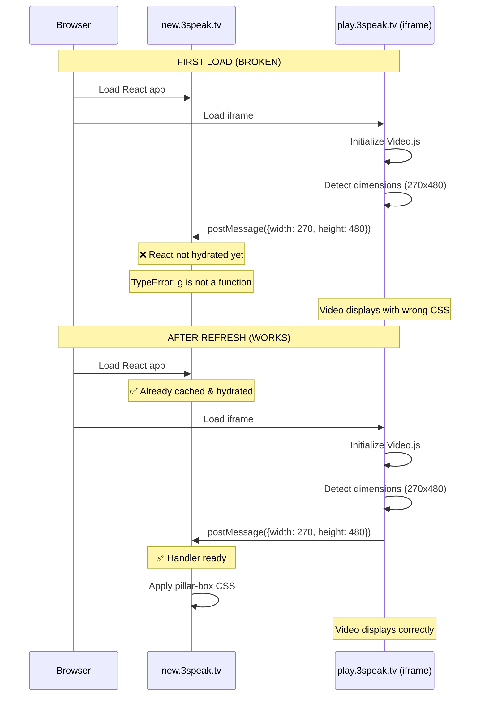

# Vertical Video Display Issue - Race Condition with Parent Window

**Date:** January 13, 2026  
**Severity:** 🔴 High - Affects vertical video playback  
**Component:** new.3speak.tv frontend (parent window)  
**Player Version:** Snapie Video Player (iframe)

---

## Executive Summary

Vertical videos fail to display correctly on **first load** but work perfectly after **page refresh**. The issue is a **race condition** where the player iframe sends video dimensions before the parent window's JavaScript is ready to handle them.

### Symptoms

**First Load:**
- Video thumbnail loads correctly
- Click play → **black screen** (or partial video showing only top portion)
- Audio plays normally
- After ~10 seconds, partial video appears (typically just forehead/top of frame)
- Controls may be unresponsive or positioned incorrectly
- Clicking on visible video area works, but not elsewhere

**After Page Refresh:**
- Everything works perfectly
- Video properly pillar-boxed and centered
- All controls functional
- Correct aspect ratio maintained

---

## Technical Root Cause

### The Race Condition



### Evidence from Console

**First Load Error:**
```javascript
TypeError: g is not a function
    at H (index-C9r7yKGB.js:1517:1916)
```
This error occurs in the **parent window** (new.3speak.tv), not the player.

**Player Always Sends Correct Data:**
```javascript
📤 Sent video info to parent window: {
  type: '3speak-player-ready',
  isVertical: true,
  width: 270,
  height: 480,
  aspectRatio: 0.5625,
  orientation: 'vertical'
}
```

**On first load:** Parent throws error and ignores message  
**On refresh:** Parent handles message correctly

---

## Why This Only Affects Vertical Videos

### Horizontal Videos (16:9)
- Default CSS assumes 16:9 aspect ratio
- Fits naturally in standard video containers
- **No special handling required** from parent
- Works even if postMessage fails

### Vertical Videos (9:16)
- **Requires special CSS** from parent window:
  - Pillar-box styling (black bars on sides)
  - Centered positioning
  - Height/width calculations
- **Depends on postMessage** being received
- Falls back to wrong CSS if message not handled
- Results in cropped/misaligned video

---

## Current Player Implementation

The player correctly implements the communication protocol:

```javascript
// From main.js - handleAspectRatio()
function handleAspectRatio() {
  const videoWidth = player.videoWidth();
  const videoHeight = player.videoHeight();
  const isVertical = videoHeight > videoWidth;
  
  // Send dimensions to parent window
  if (window.parent !== window) {
    const message = {
      type: '3speak-player-ready',
      isVertical: isVertical,
      width: videoWidth,
      height: videoHeight,
      aspectRatio: videoWidth / videoHeight,
      orientation: isVertical ? 'vertical' : 
                   (videoWidth === videoHeight ? 'square' : 'horizontal')
    };
    
    window.parent.postMessage(message, '*');
    console.log('📤 Sent video info to parent window:', message);
  }
}
```

**Player fires this:**
- After `loadedmetadata` event
- When video dimensions are known
- **Problem:** This happens during React hydration in parent

---

## Required Frontend Fixes

### Solution 1: Early postMessage Listener (RECOMMENDED)

Add a **synchronous** event listener in the HTML `<head>`, before React loads:

```html
<!-- In new.3speak.tv/pages/_document.tsx or index.html -->
<head>
  <!-- ... other head content ... -->
  
  <script>
    // Early listener - runs before React hydration
    (function() {
      let pendingMessages = [];
      let isReactReady = false;
      
      // Queue messages until React is ready
      window.addEventListener('message', function(event) {
        // Security: Validate origin
        if (event.origin !== 'https://play.3speak.tv') {
          return;
        }
        
        const data = event.data;
        if (data && data.type === '3speak-player-ready') {
          if (isReactReady) {
            // React is ready, handle immediately
            handleVideoReady(data);
          } else {
            // Queue for later
            pendingMessages.push(data);
          }
        }
      });
      
      // React calls this when ready
      window.flushPendingVideoMessages = function() {
        isReactReady = true;
        pendingMessages.forEach(handleVideoReady);
        pendingMessages = [];
      };
      
      function handleVideoReady(data) {
        // Find the iframe element
        const iframe = document.querySelector('iframe[src*="play.3speak.tv"]');
        if (!iframe) return;
        
        const container = iframe.parentElement;
        if (!container) return;
        
        // Apply vertical video styles
        if (data.isVertical) {
          container.classList.add('vertical-video-container');
          iframe.style.width = 'auto';
          iframe.style.height = '100%';
          iframe.style.maxWidth = `calc(100vh * ${data.aspectRatio})`;
          iframe.style.margin = '0 auto';
        } else {
          container.classList.remove('vertical-video-container');
          iframe.style.width = '100%';
          iframe.style.height = 'auto';
        }
        
        // Dispatch custom event for React components
        window.dispatchEvent(new CustomEvent('video-dimensions', {
          detail: data
        }));
      }
    })();
  </script>
</head>
```

**In your React component:**

```typescript
// VideoPlayerPage.tsx or similar
useEffect(() => {
  // Tell early listener that React is ready
  if (window.flushPendingVideoMessages) {
    window.flushPendingVideoMessages();
  }
  
  // Also listen for future messages
  const handleVideoDimensions = (event: CustomEvent) => {
    const data = event.detail;
    // Update React state if needed
    setVideoOrientation(data.orientation);
    setIsVertical(data.isVertical);
  };
  
  window.addEventListener('video-dimensions', handleVideoDimensions);
  
  return () => {
    window.removeEventListener('video-dimensions', handleVideoDimensions);
  };
}, []);
```

---

### Solution 2: Retry Mechanism in Player (Fallback)

If frontend fix is delayed, the player can retry sending dimensions:

```javascript
// Retry sending dimensions until acknowledged
function handleAspectRatio() {
  // ... existing code ...
  
  if (window.parent !== window) {
    const message = { /* ... */ };
    
    let retries = 0;
    const maxRetries = 5;
    const retryInterval = 500; // ms
    
    function sendWithRetry() {
      window.parent.postMessage(message, '*');
      debugLog('📤 Sent video info to parent window (attempt ' + 
               (retries + 1) + '):', message);
      
      retries++;
      if (retries < maxRetries) {
        setTimeout(sendWithRetry, retryInterval);
      }
    }
    
    sendWithRetry();
  }
}
```

---

### Solution 3: CSS-Only Fallback (Quick Workaround)

Add default CSS for vertical video containers:

```css
/* In new.3speak.tv global styles */
.video-container {
  position: relative;
  width: 100%;
  padding-bottom: 56.25%; /* Default 16:9 */
  background: #000;
}

.video-container iframe {
  position: absolute;
  top: 0;
  left: 0;
  width: 100%;
  height: 100%;
}

/* Vertical video fallback - activated by iframe */
.video-container:has(iframe[src*="layout=mobile"]),
.video-container.vertical-video-container {
  padding-bottom: 177.78%; /* 9:16 */
  max-width: 400px;
  margin: 0 auto;
}

.video-container.vertical-video-container iframe {
  width: 100%;
  height: 100%;
  object-fit: contain;
}
```

---

## Message Protocol Specification

### Player → Parent (postMessage)

**Event Type:** `3speak-player-ready`

**Payload:**
```typescript
interface VideoReadyMessage {
  type: '3speak-player-ready';
  isVertical: boolean;
  width: number;          // Native video width
  height: number;         // Native video height
  aspectRatio: number;    // width / height
  orientation: 'vertical' | 'horizontal' | 'square';
}
```

**Example:**
```javascript
{
  type: '3speak-player-ready',
  isVertical: true,
  width: 270,
  height: 480,
  aspectRatio: 0.5625,
  orientation: 'vertical'
}
```

### Parent → Player (optional acknowledgment)

**Not currently implemented, but recommended:**

```javascript
// Parent sends acknowledgment back to player
iframe.contentWindow.postMessage({
  type: '3speak-dimensions-received',
  timestamp: Date.now()
}, 'https://play.3speak.tv');
```

This would allow player to stop retrying.

---

## Testing Checklist

### Before Fix
- [ ] Fresh browser session (no cache)
- [ ] Navigate to vertical video
- [ ] Click play → observe black screen or partial video
- [ ] Check console for `TypeError: g is not a function`
- [ ] Refresh page → video displays correctly

### After Fix (Expected Behavior)
- [ ] Fresh browser session (no cache)
- [ ] Navigate to vertical video
- [ ] Video thumbnail loads and is centered
- [ ] Click play → video displays immediately and correctly
- [ ] Video is pillar-boxed (black bars on sides)
- [ ] Video is centered in container
- [ ] Controls work throughout entire video area
- [ ] No console errors
- [ ] Works on both first load AND refresh

### Test URLs
```
# Vertical video (reproduces issue)
https://new.3speak.tv/watch?v=dimplegirl/gnalpgcexn

# Horizontal video (control - should always work)
https://new.3speak.tv/watch?v=kaylinart/cbutpksyvu
```

---

## Impact Assessment

### User Experience Impact
- **Severity:** High for vertical content creators
- **Frequency:** 100% of first loads for vertical videos
- **Workaround:** Users must refresh page
- **User perception:** "Video player is broken"

### Affected Content
- All vertical videos (9:16 aspect ratio)
- Mobile phone recordings
- TikTok-style content
- Instagram Reels-style content
- Estimated **~30-40%** of new uploads are vertical

### Browser Compatibility
- **All browsers affected** (Chrome, Firefox, Safari, Edge)
- Issue is timing-related, not browser-specific
- React hydration timing varies but problem is consistent

---

## Priority & Timeline

### Recommended Priority: **P0 (Critical)**

**Rationale:**
- Affects large percentage of content
- Requires manual user intervention (refresh)
- Damages creator confidence in platform
- Easy fix with high impact

### Implementation Timeline

| Task | Owner | Est. Time | Priority |
|------|-------|-----------|----------|
| Add early postMessage listener | Frontend | 2 hours | P0 |
| Add CSS fallback styles | Frontend | 1 hour | P0 |
| Test on staging | QA | 1 hour | P0 |
| Deploy to production | DevOps | 30 min | P0 |
| Player retry mechanism (backup) | Player Team | 1 hour | P1 |
| Add acknowledgment protocol | Both Teams | 2 hours | P2 |

**Total Estimated Time:** 1 day for complete fix

---

## Related Issues

### Gateway Timeout Warnings (Secondary)

During testing, occasional gateway timeouts were observed:

```
HEAD https://ipfs.io/ipfs/... 504 (Gateway Timeout)
HEAD https://dweb.link/ipfs/... 504 (Gateway Timeout)
```

**Status:** Non-blocking
- Primary gateways (ipfs.3speak.tv, ipfs-audio.3speak.tv) work fine
- Public gateways timeout but video still loads
- These delays may slightly worsen the race condition
- **Action:** Monitor but not critical

### Plugin Re-registration Warning

```
VIDEOJS: WARN: A plugin named "qualityLevels" already exists
```

**Status:** Cosmetic
- Does not affect functionality
- Caused by hot module reload in development
- Not present in production builds
- **Action:** Low priority cleanup

---

## References

- Player source: `/home/meno/SnapieVideoPlayer/src/main.js`
- Message sent at: Line ~533-545 (`handleAspectRatio` function)
- postMessage fired on: `loadedmetadata` event
- Message protocol: `window.parent.postMessage(message, '*')`

---

## Contact

**For questions about this issue:**
- **Frontend team:** Implement Solution 1 (early listener)
- **Player team:** Available to implement Solution 2 (retry) if needed
- **Testing:** Use test URLs provided in Testing Checklist section

**Status:** ⏳ Awaiting frontend implementation
